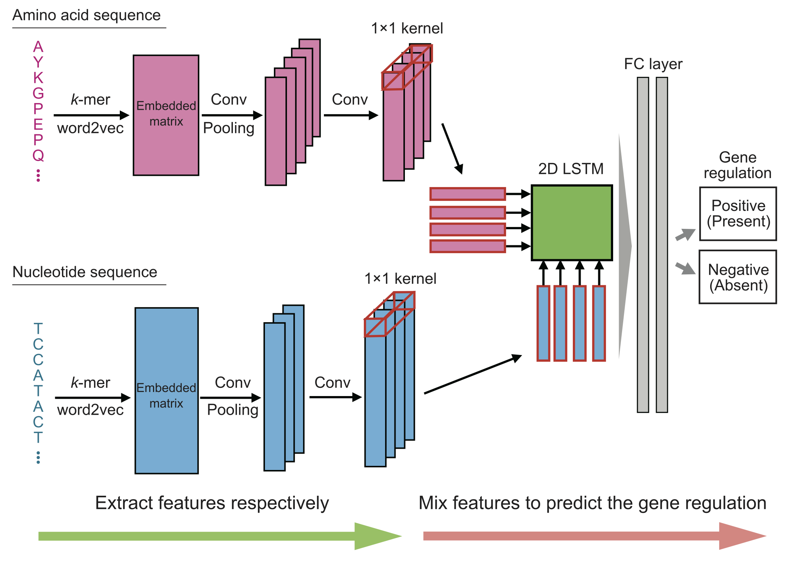

# GReNIMJA: Gene Regulatory Network Inference by Mixing and Jointing features of Amino acid and nucleotide sequences

This is the code for [Mixing features of transcription factors and genes enables accurate prediction of gene regulation relationships for unknown transcription factors](https://www.biorxiv.org/content/10.1101/2025.04.17.649264v1.article-metrics).
This project is carried out in [Funahashi Lab. at Keio University](https://fun.bio.keio.ac.jp/).

## Overview
A key point of this study is that GReNIMJA was designed, not to predict the specific TFs from genes,
to predict whether the regulatory relationships exist or not from both of the amino acid sequences of TFs
and nucleic acid sequences of genes.　　

Our model extracted features from both the amino acid sequences of TFs and the nucleotide sequences of target genes,
mixed these features using a 2D LSTM architecture, and performed binary classification to predict
the presence or absence of regulatory relationships.



The detailed information on this code is described in our paper published on [Mixing features of transcription factors and genes enables accurate prediction of gene regulation relationships for unknown transcription factors](https://www.biorxiv.org/content/10.1101/2025.04.17.649264v1.article-metrics).

## Requirements

We have confirmed that our code works correctly on Ubuntu 22.04.

- [Python 3.8.5+](https://www.python.org/downloads/)
- [Pytorch 2.4.1+](https://pytorch.org/)
- [NumPy 1.22.3+](http://www.numpy.org)
- [SciPy 1.8.0+](https://scipy.org/)
- [Pandas 1.4.1+](https://pandas.pydata.org/)
- [Gensim 4.1.2+](https://radimrehurek.com/gensim/)
- [Matplotlib 3.5.1+](https://matplotlib.org/)
- [Seaborn 0.11.2+](https://seaborn.pydata.org/)
- [scikit-learn 1.0.2+](https://scikit-learn.org/)
- [Optuna 2.10.0+](https://optuna.org/)
- [tqdm 4.64.0+](https://github.com/tqdm/tqdm)

See [`requirements.txt`](./requirements.txt) for details.

## QuickStart
### 1. Download this repository by  ```git clone```.
```shell
% git clone git@github.com:funalab/GReNIMJA.git
```

### 2. Install requirements

```sh
% cd GReNIMJA
% python -m venv venv
% source ./venv/bin/activate
% pip install --upgrade pip
% pip install -r requirements.txt
```

### 3. Download datasets, embeddings, and learned models.
**[NOTE]**  
Before downloading the related files, please check the available storage space.   
When you download and extract the ```tar.gz``` files, 
you will need at least approximately ```9.8 GB``` of storage space.


- On Linux:
```sh
% bash downloads/download_linux.sh
```
- On macOS:
```sh
% bash downloads/download_mac.sh
```

All datasets constructed in this study can be obtained by the above command.   
If you want to know how the data was constructed, please see [`scripts/`](./scripts) for details.  
These scripts are mainly written in ```Shell``` and ```R```.

### 4. Run the model (Evaluation of model performance for each unknown TF in the prediction of regulatory relationships)
- On GPU (Specify GPU ID):

```sh
% python src/test.py --gpu_id 0
```

- On CPU (Negative value of GPU ID indicates CPU)):

```sh
% python src/test.py --gpu_id -1
```

The processing time of above example will be about 2 hours on GPU (NVIDIA A100 40GB PCIe).

You can also set the specific path.  
To inference for known transcription factors,
```sh
% python src/test.py --gpu_id 0 --model_path ./models/known_best_model.pt --embeddings_path ./embeddings --dataset_path ./datasets/known_TFs/test_dataset.pickle --save_path ./results/known_test
```
To inference for unknown transcription factors,
```sh
% python src/test.py --gpu_id 0 --model_path ./models/unknown_best_model.pt --embeddings_path ./embeddings --dataset_path ./datasets/unknown_TFs/test_dataset.pickle --save_path ./results/unknown_test
```

# Acknowledgement

The research was funded by JST CREST, Japan Grant Number JPMJCR2011 
to [Tetsuya J. Kobayashi](https://research.crmind.net/) and [Akira Funahashi](https://github.com/funasoul).